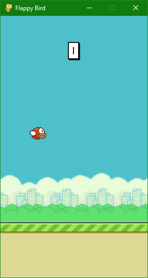

# Coding Club - FlappIA
  
## Intro

TODO : ajouter une histoire
*Un piaf dans un monde de tubes doit trouver le chemin vers la sortie*

## Consignes

- Le nom du repository est : **FlappIA_cc**  
    *[si cela ne vous dis rien nous vous invitons à lire « le coffre à jouets du petit git »]*
- En cas de question, n’hésitez pas à vous entraider et si vous êtes toujours bloqué, un cobra se fera une joie de vous aider.
- Pour l’installation veuillez suivre le tutoriel « Installation Python et ses outils ». Vous aurez besoin d’installer pygame pour ce sujet.
- Si l’installation ne se déroule pas bien demandez de l’aide à un cobra. Si ça ne fonctionne toujours pas, désinstallez tous et recommencez depuis le début !

## Intéragir

Commençons par tester le jeu tel qu'il est actuellement. Vous pouvez le lancer en utilisant python. Commencez par lancer le fichier "flappy.py".

Vous devriez voir une fenêtre apparaitre ressemblant à ceci :



Dans cette fenêtre le petit oiseau va s'écraser en boucle parce qu'il n'a pas encore de cerveau !  
Vous pouvez essayer de jouer vous même en appuyant sur espace.

Pour lui apporter de la jugotte, nous allons utiliser le fichier "bot.py" situé dans "src". Il contient le code suivant :

```py
class Bot(object):

    def __init__(self):
        pass

    def act(self, xdif, ydif, vel):
        pass
```

Tous ceci nous permet d'intéragir avec le jeu présent dans le fichier "flappy.py". Le jeu va récupérer notre objet "Bot" et lui demander d'agir avec sa fonction "act" c'est donc celle-ci que vous allez modifier en premier. Pour l'instant la fonction ne fait rien et l'oiseau tombe immédiatement par terre.

Une fonction est composé d'une définition et d'un corps, ici la définiton c'est cette ligne :

```py
    def act(self, xdif, ydif, vel):
```

Son corps est composé de tous ce qui sera indenté un cran après. L'indentation sont les espaces en début de ligne. Essayez de remplacer `pass` par `return 1` et observez le changement en relançant flappy.py.

## Algoritmes

Maintenant que vous savez comment voler il va falloir battre des ailes uniquement au bon moment !

La fonction `act` de votre bot est appelé plusieurs fois par seconde, vous devez utiliser une condition pour savoir à quel moment votre oiseau devrait battre des ailes.

En python, une condition se construit comme suit :

```py
if (condition): # si la "condition" est vraie
    action      # Faire cette action
```

Le programme nous donne accès à plusieurs variable :

| variable | description |
|:-:|-|
| xdif | Distance avant le prochain tuyaux. |
| ydif | Hauteur de l'oiseau par rapport au bord du tuyau du bas. |
| vel | Vitesse en hauteur de l'oiseau. Lorsque l'oiseau monte la valeur est entre -1 et -9 et lorsqu'il descend elle augmente avec la gravité. |

On peut commencer par se servir de ydif, si cette valeur tombe à 0 cela veut dire que l'oiseau va se prendre le tuyau ! Pour éviter ça voici notre condition : `ydif < 0`. On peut la lire "Si la hauteur de l'oiseau par rapport au tuyaux est inférieure à zéro".

Utilisez un `if` pour battre des ailes lorsque l'oiseau est trop bas.

Si vous avez réussi à faire battre des ailes à votre oiseau lorsqu'il est trop bas, il devrait malheureusement se prendre le tuyau quand même. Mince alors il semblerait que l'on ne peut pas rester juste au dessus de 0 changez la valeur de zéro pour trouver une position équilibrée.

Une fois que votre oiseau arrive au dela de 10 points, réfléchissez en groupe à comment améliorer la logique de votre oiseau. Prenez le temps de chercher comment vous servir des éléments à votre disposition.

## Intelligence Artificielles et Machine Learning

Vous avez maintenant crée une petite intelligence artificielle !

> Le terme "Intelligence artificielle" désigne toute chose crée qui imite l'intelligence. Ce n'est pas limité aux avancées complexes qui se font dans ce domaine.

A la fin de la session, quelqu'un vous présentera le fonctionnement du "Machine Learning" (Aprentissage Machine) qui permettra à l'oiseau d'apprendre de ses erreurs et de s'améliorer tous seul !
